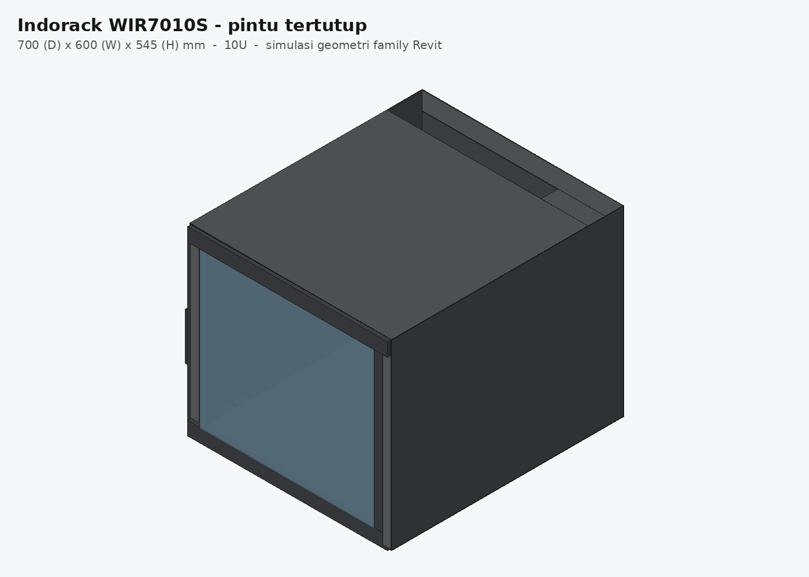
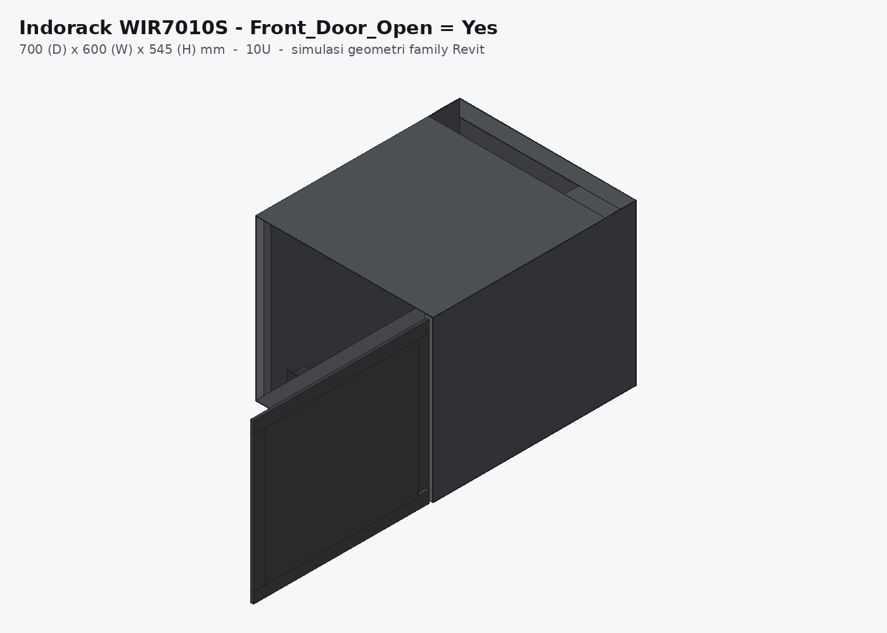
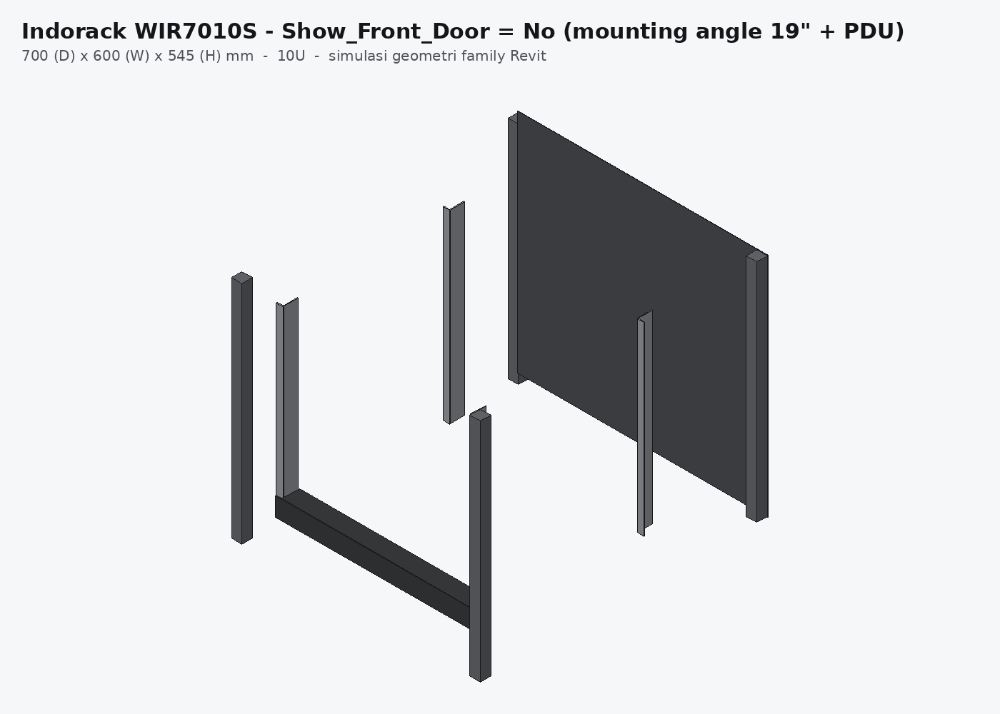

# Family Revit 2025 — Indorack Wallmount Rack 19" Single Glass Door (WIR7010S)

Family Revit parametrik yang dibangun dari datasheet **Indorack WIR7010S —
Wallmount 19 inch Series, Single Glass Door**. Ukuran utama (Depth / Width /
Height) dan jumlah U bisa diatur, jadi satu family ini bisa dipakai untuk
seluruh varian wallmount rack 19" (4U s/d 20U, depth 400–700 mm).



---

## 1. Data dari datasheet

| Item | Nilai |
|---|---|
| Product Type | Single Door Wallmount Rack |
| Product ID | WIR7010S |
| Size | 10U |
| Weight | ± 31 kg |
| Dimension (D x W x H) | **700 x 600 x 545 mm** |
| Static loading capacity | 60 kg |
| Standar | 19 inch international standard, metric system & ETSI, welded structure |
| Lebar daun pintu depan | 595 mm (gambar hal. 2) |
| Tebal daun pintu | ± 8–10 mm (gambar hal. 2) |
| Sudut buka pintu depan & samping | > 180° |
| Kelengkapan | Glass front door + 2 side door with lock · 1 unit horizontal PDU 6 outlet with switch · 1 unit single fan 220VAC · 1 pc top brush panel · 4 pcs dynabolt 88 mm · 20 set M06 (cagenut & screw) |
| Komponen (gambar hal. 1) | 1 Frame · 2 Front Door · 3 Top/Bottom/Back Panel · 4 Mounting Angle · 5 Side Door · 6 Mounting Profile |
| Cable entry | dari atas dan bawah |

Scan datasheet ada di `docs/datasheet-hal1.png` dan `docs/datasheet-hal2.png`.

**Relasi tinggi vs jumlah U** (dipakai sebagai formula di family):

```
Height = U_Count x 44.45 mm + 100.5 mm
10U  ->  10 x 44.45 + 100.5 = 545 mm   (cocok dengan datasheet)
```

---

## 2. Isi folder

```
revit/indorack-wallmount-rack/
├─ scripts/
│  ├─ build_indorack_wallmount_rack.py   <- SCRIPT UTAMA, jalankan di Revit
│  └─ _selftest/                          <- uji logika script di luar Revit (mock API)
├─ type-catalog/
│  └─ Indorack_Wallmount_Rack_19in_SingleGlassDoor.txt
└─ docs/                                  <- preview + scan datasheet
```

Revit tidak bisa menerima file `.rfa` yang dibuat di luar Revit (format biner
tertutup), jadi deliverable-nya berupa **script generator**: dijalankan sekali
di Revit 2025, hasilnya file `.rfa` asli lengkap dengan geometry, parameter,
constraint, material, dan family types.

---

## 3. Cara menjalankan

### Opsi A — pyRevit (paling gampang)
1. Install pyRevit (gratis) → buka Revit 2025.
2. `pyRevit` tab → `pyRevit` → **Run Script…** → pilih
   `scripts/build_indorack_wallmount_rack.py`.
3. Tunggu ± 10–30 detik. Log muncul di output window.

### Opsi B — RevitPythonShell
1. Buka Revit 2025 → tab `Add-Ins` → `Revit Python Shell` → **Open Python Shell**.
2. Menu shell: `File > Open` → pilih script-nya → **Run**.

### Opsi C — Dynamo (bawaan Revit, tanpa install apa pun)
1. `Manage > Dynamo` → New.
2. Tarik node **Python Script** → Edit → hapus isinya → paste seluruh isi
   `build_indorack_wallmount_rack.py` → Save → Run.

Hasil: `C:\Users\<nama>\Documents\Indorack_Wallmount_Rack_19in_SingleGlassDoor.rfa`
(kalau ada project yang terbuka, family-nya sekaligus di-load ke project itu).

---

## 4. Orientasi & titik sisip (penting saat penempatan)

```
        Z (tinggi)
        |            Y = 0  -> BIDANG BELAKANG rak (menempel dinding)
        |            badan rak ke arah -Y, pintu kaca di y = -Depth
        +------ X    X = 0  -> tengah rak (simetris kiri-kanan)
                     Z = 0  -> dasar rak
```

Origin family = **tengah–belakang–bawah**. Jadi saat ditempel ke dinding,
panel belakang rak persis di muka dinding, dan kalau Depth diubah rak
"tumbuh" ke depan — bukan menembus dinding. Ketinggian pasang diatur lewat
parameter instance bawaan Revit (`Elevation from Level` / `Offset`).

Kalau mau family yang bisa ditempel langsung ke permukaan dinding
(`Place on Face`), ubah di bagian KONFIGURASI script:
`WORK_PLANE_BASED = True`.

---

## 5. Parameter

### Ukuran utama (yang diminta bisa diatur)

| Parameter | Default | Keterangan |
|---|---|---|
| `Rack_Depth` | 700 mm | Kedalaman (D) |
| `Rack_Width` | 600 mm | Lebar / panjang (W) |
| `Rack_Height` | 545 mm | Tinggi (H) — **read-only, hasil formula** |
| `U_Count` | 10 | Jumlah U (menggerakkan tinggi & panjang mounting angle) |
| `Height_Auto` | Yes | Yes = tinggi ikut U_Count; No = pakai `Rack_Height_Manual` |
| `Rack_Height_Manual` | 545 mm | Tinggi manual, aktif kalau `Height_Auto = No` |

> **Cara ubah tinggi bebas:** set `Height_Auto = No`, lalu isi
> `Rack_Height_Manual`. Kalau `Height_Auto = Yes`, tinggi otomatis
> `U_Count x 44.45 + 100.5 mm`.

### Konstruksi

`Panel_Thickness` (1.5) · `Frame_Profile_Size` (25) · `Door_Thickness` (10) ·
`Door_Gap` (2.5 → lebar pintu 595) · `Door_Frame_Width` (40) ·
`Glass_Thickness` (4) · `Door_Width`, `Door_Height` (formula)

### Mounting angle 19" (EIA-310)

`Rail_Standard_Width` (482.6 = 19") · `Rail_Hole_Spacing` (465.1) ·
`Rail_Flange_Width` (15.9) · `Rail_Leg_Depth` (35) · `Rail_Thickness` (2) ·
`Rail_Front_Setback` (50, **instance** — geser rail depan-belakang) ·
`Rail_Rear_Setback` (400) · `Rail_Height`, `Rail_Bottom_Offset` (formula)

### Aksesoris & tampilan (instance, kecuali disebut)

| Parameter | Default | Fungsi |
|---|---|---|
| `Show_Front_Door` | Yes | tampil/sembunyikan pintu kaca |
| `Front_Door_Open` | No | Yes = pintu digambar terbuka 90° (engsel kanan) — untuk cek clearance |
| `Show_Side_Doors` | Yes | side door kiri-kanan |
| `Show_Rails` | Yes | mounting angle |
| `Show_Rear_Rails` | No (type) | pasang sepasang mounting angle belakang |
| `Show_Fan` / `Fan_Count` | Yes / 1 (type) | fan di panel atas (maks 2 posisi) |
| `Show_PDU` | Yes | PDU 6 outlet 1U |
| `Show_Brush_Panel` | Yes (type) | brush panel / cable entry atas |
| `Show_Wall_Holes` | Yes (type) | plat titik dynabolt di panel belakang |

### Info & identitas

`Max_Equipment_Depth` (formula — kedalaman maksimum perangkat yang muat) ·
`Wall_Hole_Spacing_X` / `_Z` (formula — jarak titik dynabolt) ·
`Product_ID` · `Product_Type` · `Rack_Standard` · `Mounting_Method` ·
`Finish_Color` · `Included_Accessories` · `Weight_kg` · `Static_Load_kg`
serta parameter bawaan Manufacturer / Model / Type Mark / Description / URL.

### Material (bisa diganti di Family Types)

`Material_Body` · `Material_Glass` · `Material_Rail` · `Material_Accessory`

### Subcategory (untuk kontrol visibilitas & warna per bagian)

`Frame` · `Panels` · `Doors` · `Glass` · `Mounting Angle` · `Accessories` ·
`Wall Mounting`. Bagian kecil (handle, lock, outlet PDU, fan) hanya muncul di
detail level **Medium/Fine**, jadi view Coarse tetap ringan.

---

## 6. Family types bawaan

Script langsung membuat 14 type (depth 400/500/600/700 mm, 6U–20U).
Type dari datasheet: **`WIR7010S - 10U D700`**.

Alternatif: pakai **type catalog** di `type-catalog/`. Taruh file `.txt`
tersebut satu folder dengan `.rfa` (nama file harus persis sama), lalu saat
`Load Family` Revit akan menampilkan daftar type untuk dipilih — supaya project
tidak kemasukan type yang tidak dipakai.

---

## 7. Flex test (wajib, 2 menit)

Setelah `.rfa` terbuka:

1. `Create > Family Types`.
2. Ubah `U_Count` 10 → 18 → **Apply**. Tinggi harus jadi 900.6 mm dan
   mounting angle ikut memanjang.
3. Ubah `Rack_Depth` 700 → 500 → **Apply**. Pintu, panel atas/bawah, dan side
   door harus ikut pendek; panel belakang tetap di posisi (y = 0).
4. Ubah `Rack_Width` 600 → 800 → **Apply**. Bodi melebar simetris, sedangkan
   mounting angle **tetap 19"** (memang harus begitu).
5. Kembalikan ke 10U / 700 / 600.

Script mengunci muka solid ke reference plane pakai *Align + lock*
(78 constraint). Kalau ada bagian yang tidak ikut bergerak, lihat baris
`! Align gagal ...` di log, lalu kunci manual: `Modify > Align`, klik
reference plane dulu, klik muka solid, lalu klik gemboknya.

---

## 8. Preview

| Pintu tertutup | Pintu terbuka (`Front_Door_Open = Yes`) | Mounting angle + PDU |
|---|---|---|
|  |  |  |

Gambar di atas dibuat dari simulasi geometry script (lihat `scripts/_selftest/`),
bukan screenshot Revit.

---

## 9. Asumsi & batasan (harap dibaca)

Yang **diambil langsung dari datasheet**: 700 x 600 x 545 mm, 10U, lebar pintu
595 mm, berat 31 kg, static load 60 kg, komposisi komponen dan kelengkapan.

Yang **diasumsikan** karena tidak tercantum di datasheet:

| Item | Asumsi | Dampak |
|---|---|---|
| Tebal plat | 1.5 mm | visual saja |
| Ukuran mounting profile sudut | 25 x 25 mm | visual |
| Tebal daun pintu | 10 mm | diambil dari notasi 8/10 mm di gambar hal. 2 |
| Posisi rail depan | 50 mm dari bidang depan | bisa diatur via `Rail_Front_Setback` |
| Rail belakang | default tidak dipasang | aktifkan `Show_Rear_Rails` kalau unit punya 4 rail |
| Posisi fan & brush panel | diukur dari sisi belakang | supaya tetap valid saat Depth diubah |
| Engsel pintu depan | di sisi kanan, handle di kiri | sesuai foto datasheet |
| Kode type selain WIR7010S | mengikuti pola `WIR<depth><U>S` | **verifikasi ke katalog Indorack sebelum dipakai di dokumen tender** |

Yang **tidak dimodelkan** (sengaja, supaya family ringan): lubang perforasi
panel samping/pintu, pola lubang cage nut per U, detail engsel dan L tower bolt
lock, kabel, dan grille fan detail. Untuk kebutuhan BIM koordinasi/clash
detection, level detail ini sudah cukup; kalau perlu perforasi, tambahkan
sebagai material dengan render appearance bertekstur, bukan geometry.

---

## 10. Troubleshooting

| Gejala | Solusi |
|---|---|
| `Template ... tidak ketemu` | Isi `TEMPLATE_FILE` di bagian KONFIGURASI dengan path lengkap `Metric Generic Model.rft` |
| Mau kategori lain (Data Devices / Electrical Equipment) | ubah `FAMILY_CATEGORY` di KONFIGURASI |
| Mau D/W/H jadi instance parameter (beda-beda per rack tanpa bikin type) | set `DIMS_AS_INSTANCE = True` (type catalog jadi tidak berlaku) |
| Family tidak otomatis masuk project | load manual: `Insert > Load Family` |
| Ada `! Align gagal` di log | kunci manual pakai `Modify > Align` seperti di bagian 7 |

---

## 11. Uji mandiri di luar Revit

`scripts/_selftest/` berisi mock Revit API untuk mengecek logika script tanpa
membuka Revit (dipakai saat pengembangan):

```bash
cd scripts/_selftest
python3 run_mock.py       # jalankan builder di atas mock API + ringkasan
python3 dump_solids.py    # dump seluruh solid ke solids.json
python3 render.py         # render preview isometrik
```

Hasil uji terakhir: 65 parameter, 13 formula, 56 solid, 17 reference plane,
16 dimensi berlabel, 78 alignment — tanpa error.
Yang diuji adalah logika script (koordinat, urutan API, formula), bukan
perilaku Revit itu sendiri — jadi flex test di bagian 7 tetap wajib.
